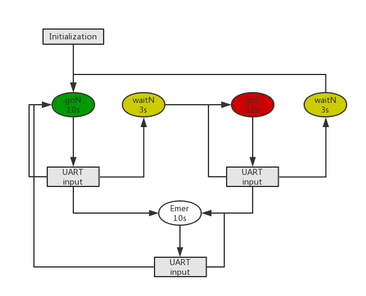
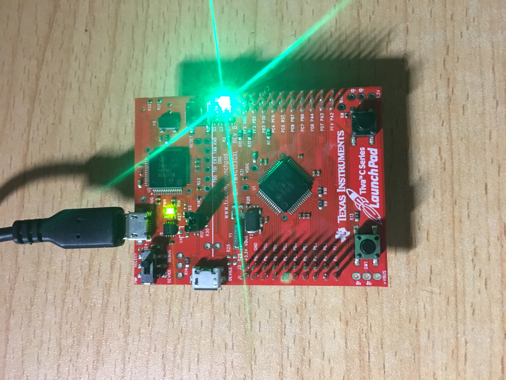
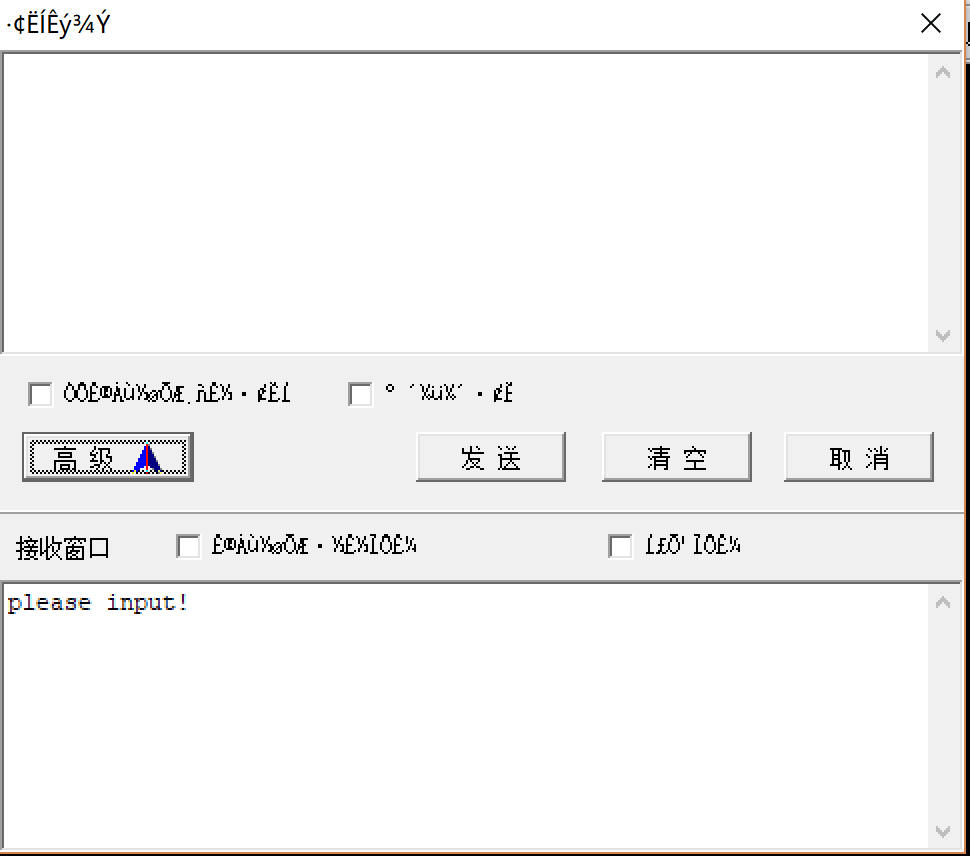
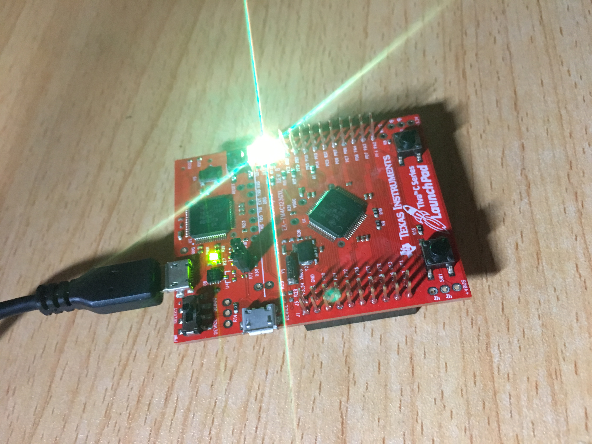
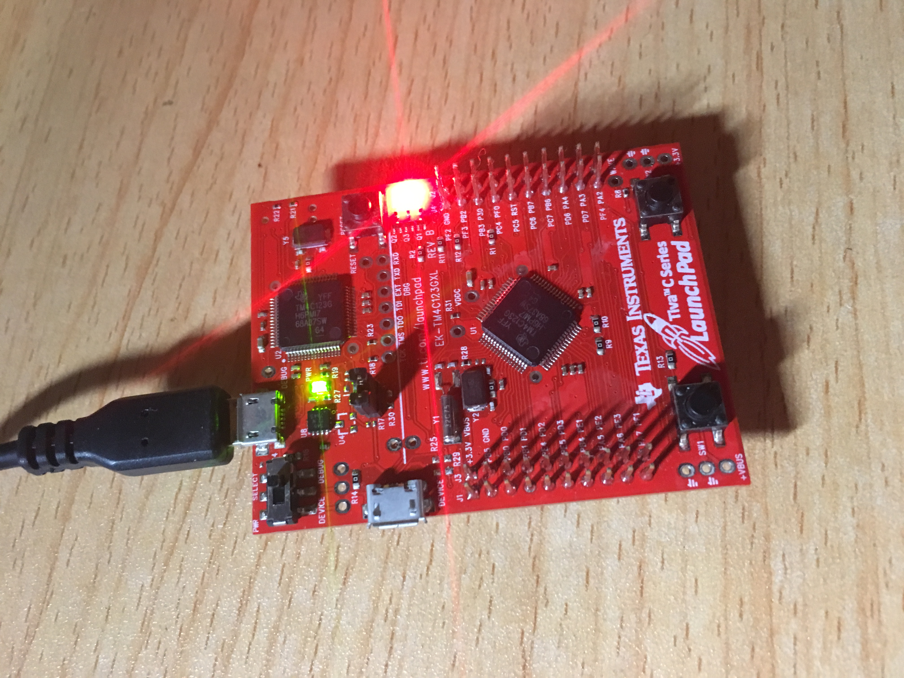
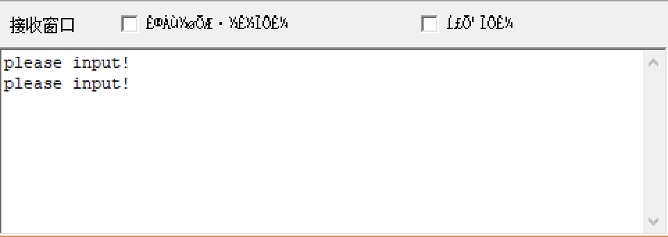
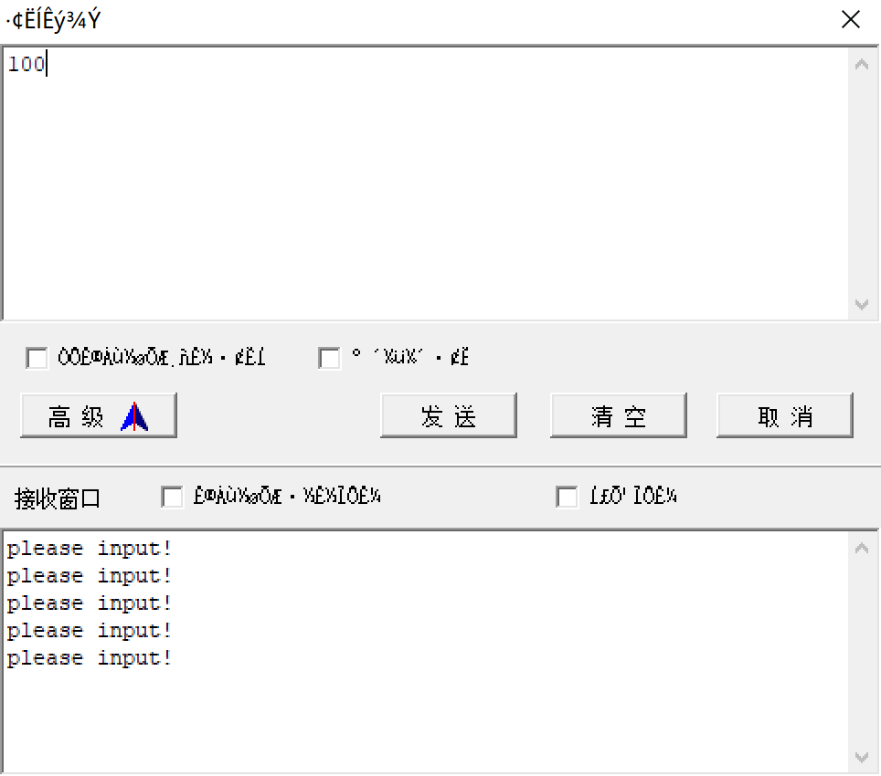
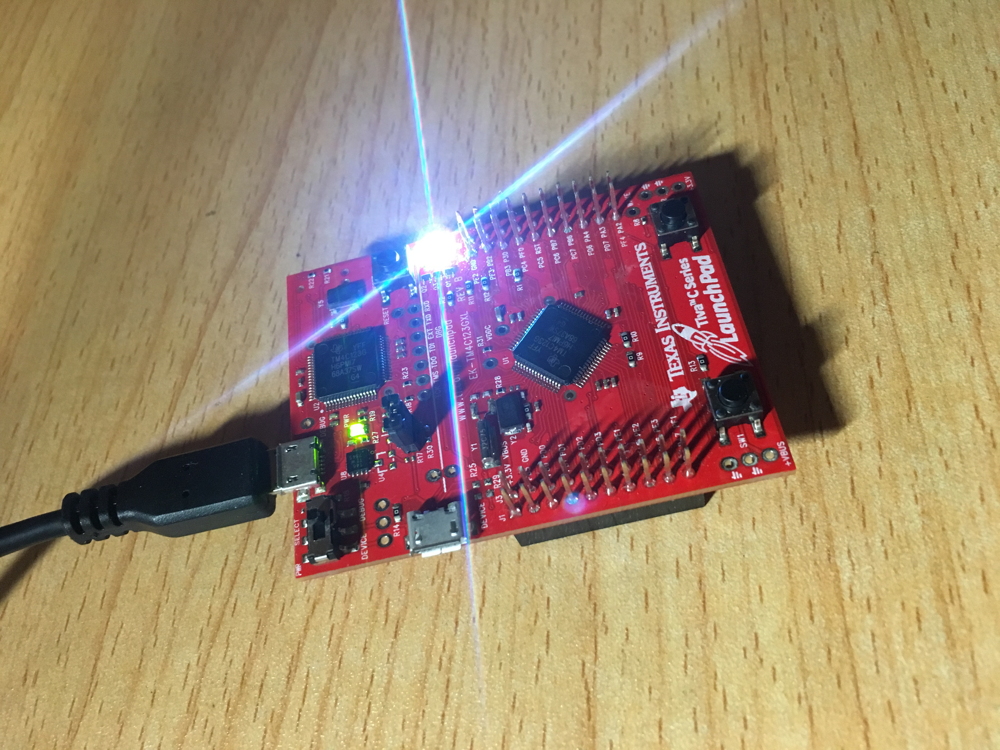

# TLMS 实验报告

> 作者：郑钊  计算机应用  15331424<br/>
> 时间：2018-07-03

[TOC]

## 1. 设计思路

本次实验项目，综合了《嵌入式系统案例分析》课程的四部分内容：**GPIO**、**UART**、**中断**、**系统定时器**、**状态机**、**LED**，实现了一个基础的**交通信号灯管理系统**（下面简称 **TLMS**）。

## 2. 实现功能 

> 假定在一个有南/北、东/西方向车流的十字路口：
> 1. 初始状态为：南/北方向绿灯，东/西方向红灯。
> 2. 计时 10s 之后，若检测到东/西方向有车流（若无车流则直接维持信号灯的当前状态），则改变交通灯的状态为：南/北方向红灯，东/西方向绿灯，且中间会有短暂的黄灯等待时间（3s）。
> 3. 整个系统按照上述规则不断地循环切换状态。
> 4. 南/北，东/西方向的车流有无可以通过 EasyARM 程序的串口输入来进行人为控制。
> 5. 信号灯的状态可以直接观察 LED 灯得到。

本次实验项目通过下面五点体现课程内容。

### 2.1. 状态机

#### 2.1.1. TLMS 五个状态

+ **goN**：南北方向通行
+ **waitN**：南北方向等待
+ **goE**：东西方向通行
+ **waitE**：东西方向等待
+ **Emer**：紧急状态

#### 2.1.2. 状态转换表

| State\PE2-0 | 000  | 001   | 010   | 011   | 1XX  |
| ----------- | ---- | ----- | ----- | ----- | ---- |
| goN         | goN  | waitN | goN   | waitN | Emer |
| waitN       | goE  | goE   | goE   | goE   | Emer |
| goE         | goE  | goE   | waitE | waitE | Emer |
| waitE       | goN  | goN   | goN   | goN   | Emer |
| Emer        | goN  | goN   | goN   | goN   | Emer |

#### 2.1.3. 状态机的结构

```C
struct State {
  uint32_t Out;                 // 6-bit 输出
  uint32_t Time;                // 维持该状态的时间
  uint32_t Color;               // 对应的 LED 灯颜色
  const struct State *Next[8];  // 下一个状态转换
};
```

### 2.2. 系统计时器

这里我使用的是**查询模式**下的系统计时器，用于状态机对应时间的等待。

### 2.3. UART 串口输入/输出

当状态机处于 **goN**, **goE**, **Emer** 三种状态的时候，程序会输出 `please input!` 到 EasyARM，然后从 EasyARM 输入三个字符（总共 8 种情况，从 000 到 111），程序接收到输入之后，状态机切换状态。

### 2.4. 中断

本项目是间接使用了中断功能，因为 UART 中接收用户的输入函数 `UART_InChar()` 是通过中断实现的。

### 2.5. LED

+ **goN** 显示绿灯
+ **waitN** 显示黄灯
+ **goE** 显示红灯
+ **waitE** 显示黄灯
+ **Emer** 显示白灯

## 3. 实验环境与相关工具

+ 开发环境：Windows 10
+ 开发工具：Keil uVision4
+ 嵌入式板：Texas TM4C123
+ 辅助软件：EasyARM

## 4. 程序流程图



## 5. 实际运行现象

1. 初始状态为 **goN**（绿灯），等待 10s 后提示 UART 输入。





2. 输入 011，代表南北方向都有车，状态变为 **waitN**（黄灯），等待 3s。



3. 黄灯之后，不用输入直接进入 **goE** 状态（红灯），等待 10s 后提示 UART 输入。





4. 输入 100，代表紧急状态，状态变为 **Emer**（白灯），等待 10s 后提示 UART 输入。





## 6. 设计分析 & 心得

这次期末实验项目对我个人来说意义很大，因为综合了这个许多内容。设计灵感主要来源于期中的交通灯状态机项目，基于此，我加入了 UART 串口、LED 灯、中断、系统计时器等功能，实现了一个更为复杂的交通信号灯管理系统。

由于要讲不同的内容综合在一起，需要仔细分析不同内容的工程案例，分析出哪部分是必要的，哪部分是可许的，这样再进行代码的融合。

通过这次实验，我也对状态机这个概念有了深刻的理解，毕竟已经在本次项目里用 C 语言实现出来了。另外也增加对于系统计时器的了解，系统计时器有两种模式，中断模式和查询模式，前者是在计时 RELOAD 的时候触发一次中断，然后程序跳到相应的中断服务程序；查询模式则是通过改变寄存器中的某个标志位来标明计时时间到。

最后，感谢郭雪梅老师开设这门《嵌入式系统案例分析与设计》课程，让我有机会接触嵌入式的一些几本的概念和玩法，也确实有学到了东西。

友情鸣谢赖秀娜与王世祺这两位优秀的同学，在我做本次实验项目的时候提供了许多帮助。

## 7. 代码

> 完整的工程代码参考：`TLMS.zip`

关键代码文件：

```C
// PointerTrafficLight.c
#include <stdint.h>
#include "inc/tm4c123gh6pm.h"
#include "PLL.h"
#include "SysTick.h"
#include "UART.h"

#define LIGHT                   (*((volatile uint32_t *)0x400051FC))
#define GPIO_PORTB_OUT          (*((volatile uint32_t *)0x400051FC)) // bits 0~6
#define GPIO_PORTE_IN           (*((volatile uint32_t *)0x4002401C)) // bits 0~2
#define SENSOR                  (*((volatile uint32_t *)0x4002401C))

struct State {
  uint32_t Out;            // 6-bit output
  uint32_t Time;           // 
  uint32_t Color;
  const struct State *Next[8];
};  // depends on 3-bit input
typedef const struct State STyp;
	
#define goN   &FSM[0]  // GREEN
#define waitN &FSM[1]  // YELLOW
#define goE   &FSM[2]  // RED
#define waitE &FSM[3]  // YELLOW
#define Emer  &FSM[4]  // WHITE

#define PF1       (*((volatile uint32_t *)0x40025008))
#define PF2       (*((volatile uint32_t *)0x40025010))
#define PF3       (*((volatile uint32_t *)0x40025020))
#define LEDS      (*((volatile uint32_t *)0x40025038))
#define RED       0x02
#define GREEN     0x08
#define YELLOW    0x0A
#define WHITE     0x0E
#define WHEELSIZE 4           // must be an integer multiple of 2
const long COLORWHEEL[WHEELSIZE] = {GREEN, YELLOW, RED, WHITE};  // red, yellow, green, white

STyp FSM[5]={
 {0x21, 10, GREEN,  {goN, waitN, goN,   waitN, Emer, Emer, Emer, Emer}},
 {0x22, 03, YELLOW, {goE, goE,   goE,   goE,   Emer, Emer, Emer, Emer}},
 {0x0C, 10, RED,    {goE, goE,   waitE, waitE, Emer, Emer, Emer, Emer}},
 {0x14, 03, YELLOW, {goN, goN,   goN,   goN,   Emer, Emer, Emer, Emer}},
 {0x40, 10, WHITE,  {goN, goN,   goN,   goN,   Emer, Emer, Emer, Emer}}
};


void Ports_Init(void) {
  SYSCTL_RCGCGPIO_R |= 0x32;
  while((SYSCTL_PRGPIO_R&0x0020) == 0){};  // ready?

  // Port F
  GPIO_PORTF_DIR_R |= 0x0E;        // make PF3-1 output (PF3-1 built-in LEDs)
  GPIO_PORTF_AFSEL_R &= ~0x0E;     // disable alt funct on PF3-1
  GPIO_PORTF_DEN_R |= 0x0E;        // enable digital I/O on PF3-1
  GPIO_PORTF_PCTL_R = (GPIO_PORTF_PCTL_R&0xFFFFF0FF)+0x00000000;  // configure PF3-1 as GPIO
  GPIO_PORTF_AMSEL_R = 0;          // disable analog functionality on PF

  // Port E
  GPIO_PORTE_DIR_R &= ~0x07;   // make PE2-0 in
  GPIO_PORTE_AFSEL_R &= ~0x07; // disable alt func on PE2-0
  GPIO_PORTE_DEN_R |= 0x07;    // enable digital I/O on PE2-0
  GPIO_PORTE_PCTL_R = (GPIO_PORTE_PCTL_R&0xFFFFFFF0)+0x00000000;  // configure PE2-0 as GPIO, 0xFFFFFF00
  GPIO_PORTE_AMSEL_R &= ~0x07; // disable analog functionality on PE2-0

  // Port B
  GPIO_PORTB_DIR_R |= 0x7F;    // make PB6-0 out
  GPIO_PORTB_AFSEL_R &= ~0x7F; // disable alt func on PB6-0
  GPIO_PORTB_DEN_R |= 0x7F;    // enable digital I/O on PB6-0         
  GPIO_PORTB_PCTL_R &= ~0x0FFFFFFF;  // configure PB6-0 as GPIO, 0x00FFFFFF
  GPIO_PORTB_AMSEL_R &= ~0x7F; // disable analog functionality on PB6-0
}

uint32_t GetInput() {
  static char input[3];             // global to assist in debugging
  uint32_t result = 0;
  OutCRLF();
  UART_OutString("please input!\n");
  input[0] = UART_InChar();
  input[1] = UART_InChar();
  input[2] = UART_InChar();
  if (input[0]=='1') result |= 0x4;
  if (input[1]=='1') result |= 0x2;
  if (input[2]=='1') result |= 0x1;
  return result;
}

int main(void){
  STyp *Pt;                    // state pointer
  uint32_t Input;
  char ch;
  uint32_t n;

  PLL_Init();                  // configure for 50 MHz clock
  SysTick_Init();              // initialize SysTick timer
  Ports_Init();                // initialize GPIO ports
  UART_Init();                 // initialize UART

  Pt = goN;                    // initial state: Green north; Red east
  while(1) {
    LIGHT = Pt->Out;           // set lights to current state's Out value
    LEDS = Pt->Color;          // set LED color
    WaitSeconds(Pt->Time);
    if (Pt->Color != YELLOW) Input = GetInput();
    Pt = Pt->Next[Input];      // transition to next state
  }
}
```
